# Code Craft Pro.

CodeCraftPro is a collaborative coding platform powered by Node.js, React.js, and Socket.IO. It enables real-time code editing and project management for software development teams. With features like user authentication, workspace management, and file sharing, it streamlines the coding process, allowing teams to work together seamlessly. Boost productivity and streamline collaboration with CodeCraftPro.

## Tech-stack
* Node.js
* React.js
* Socket.IO
* Socket.IO-client
* Mongoose
* Express
* MongoDB
* Postman

> Recommended to use Node v20.0 or higher

## Project Setup & Backend APIs
Link: https://github.com/thatbackendguy/code-craft-pro

## Screenshots
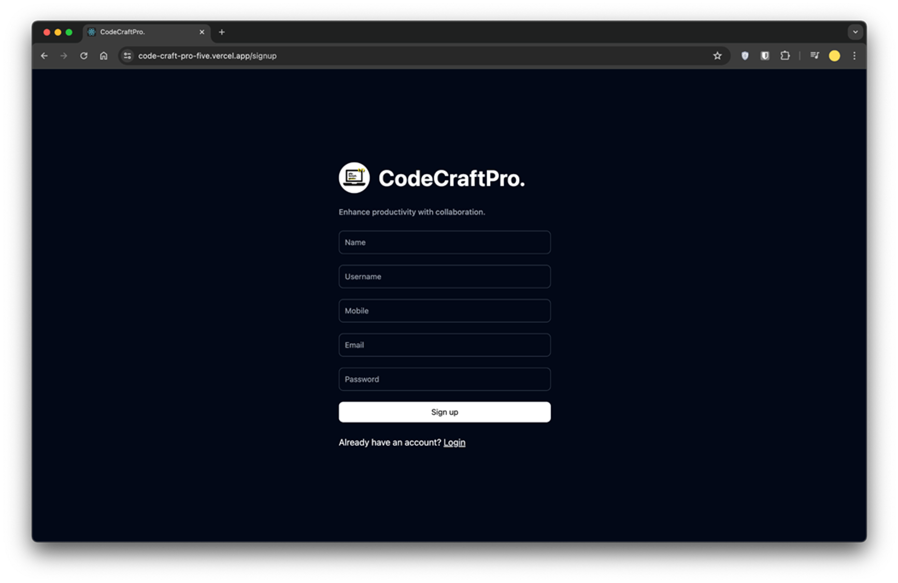
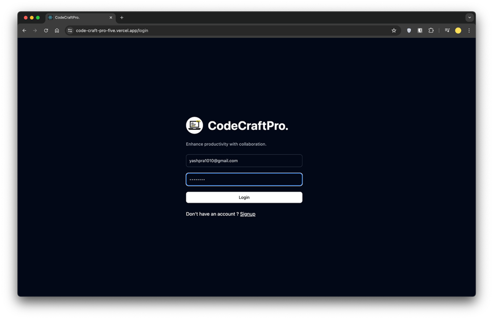
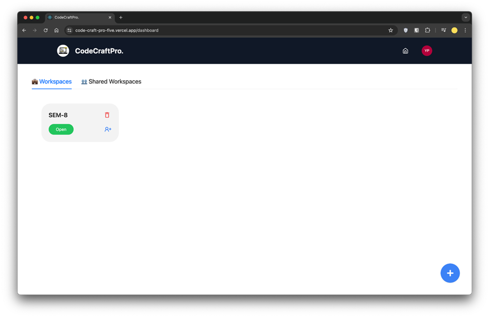
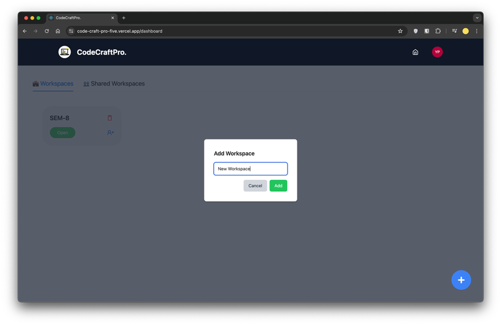
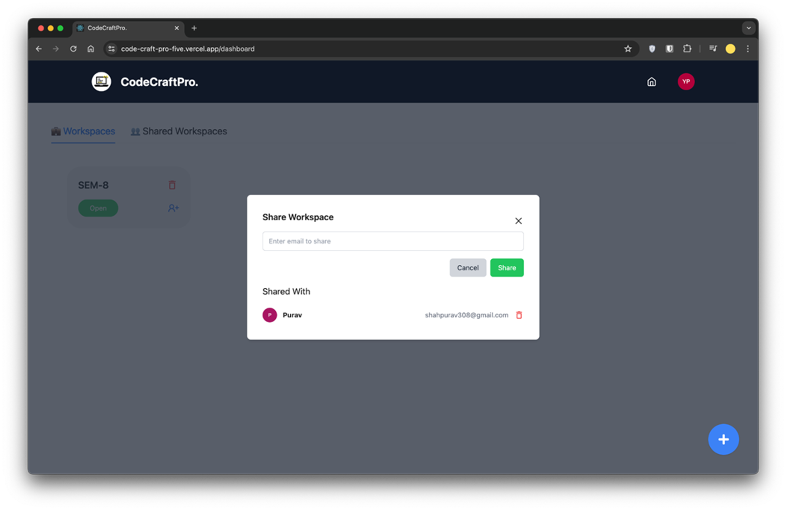
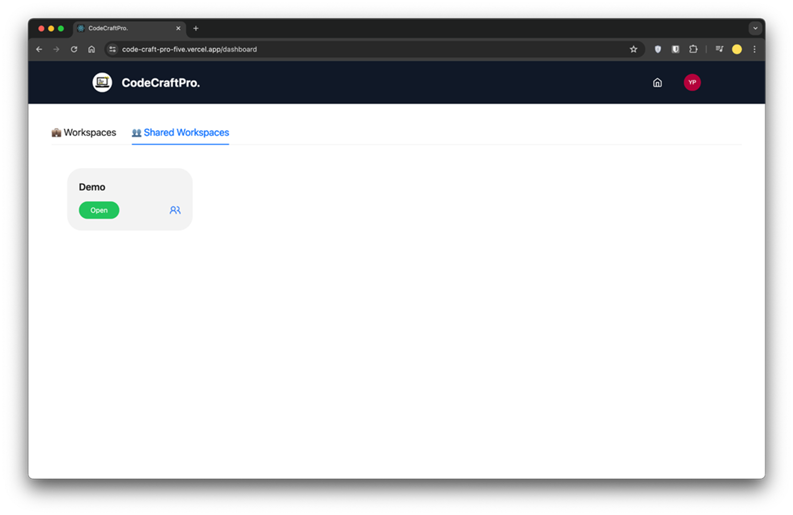
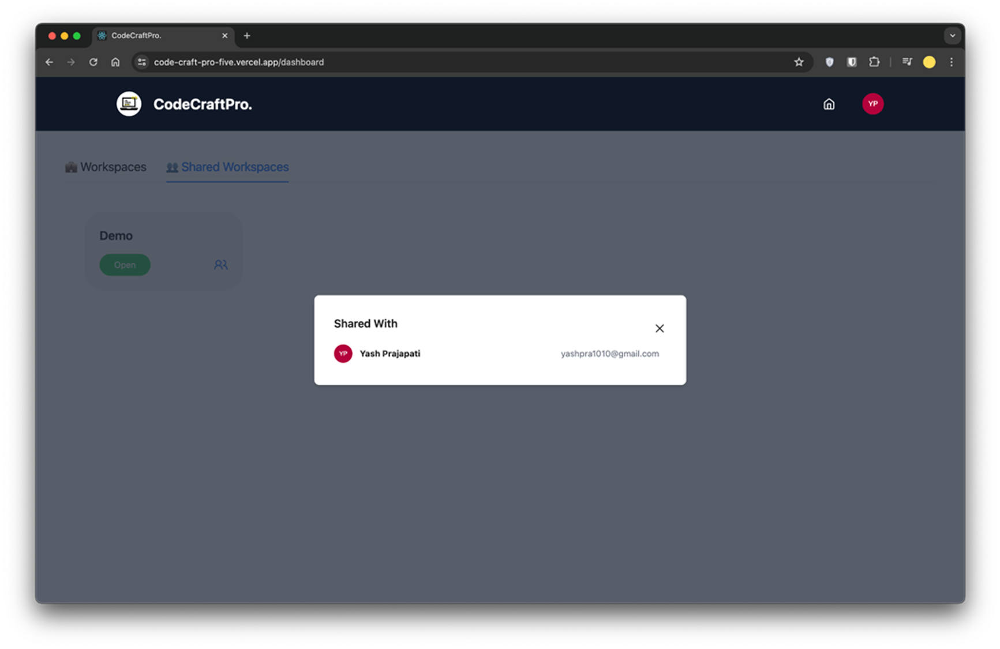
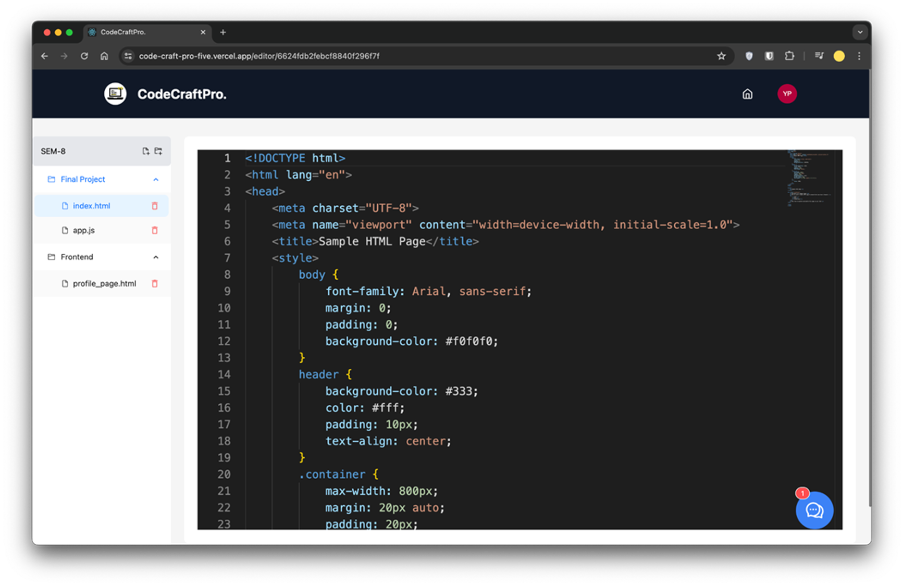
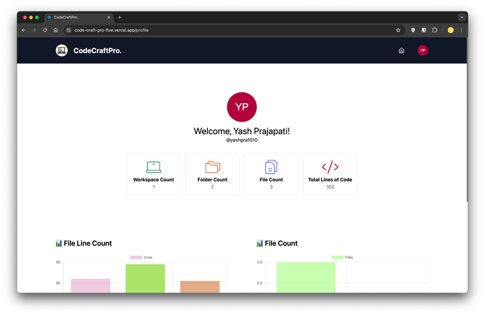
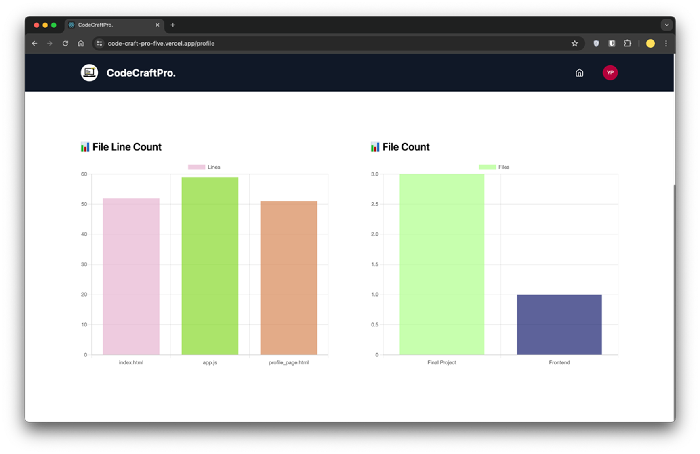
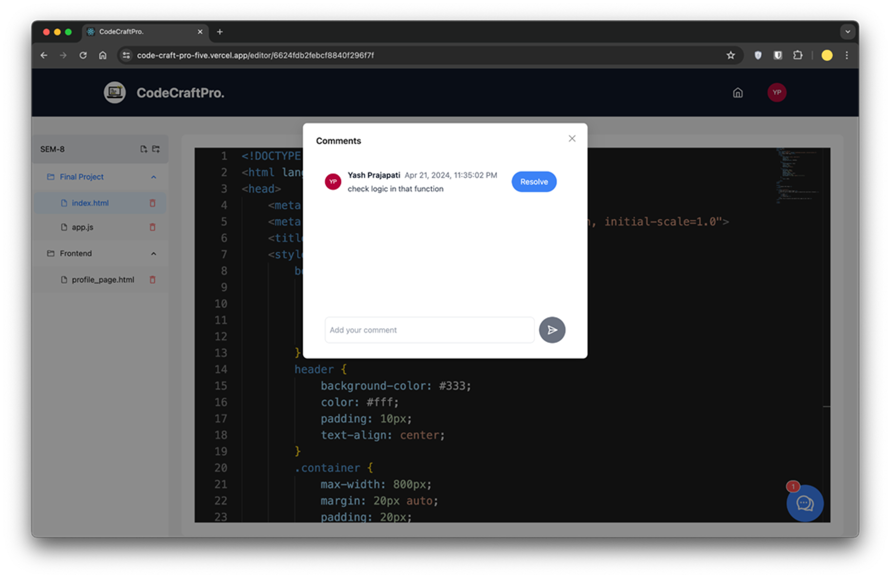
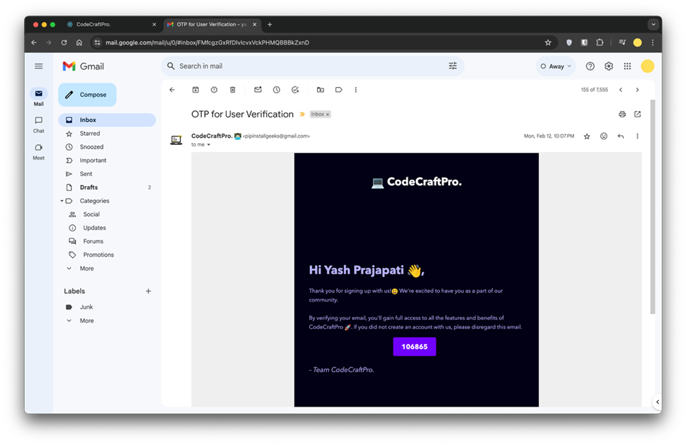
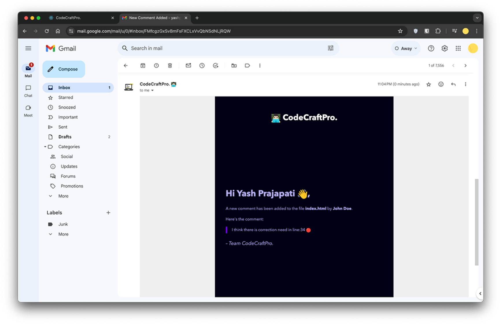
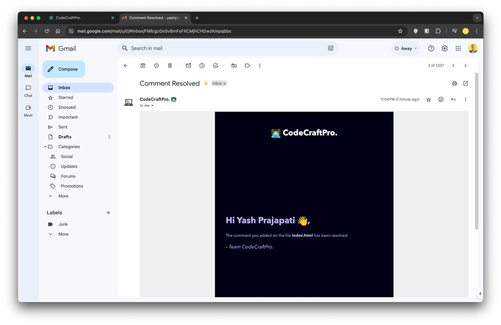

## GitHub Repo
