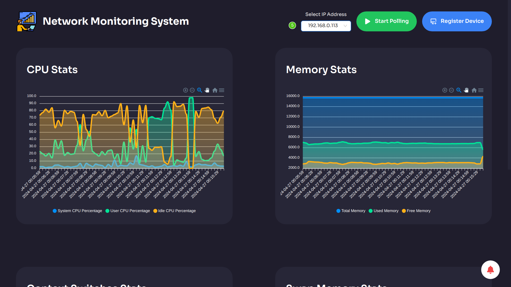
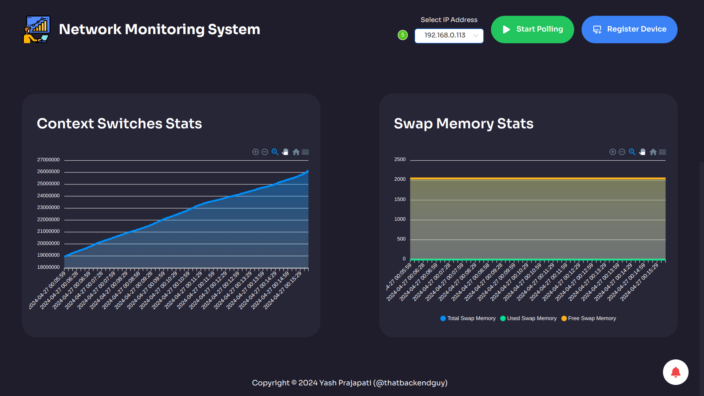
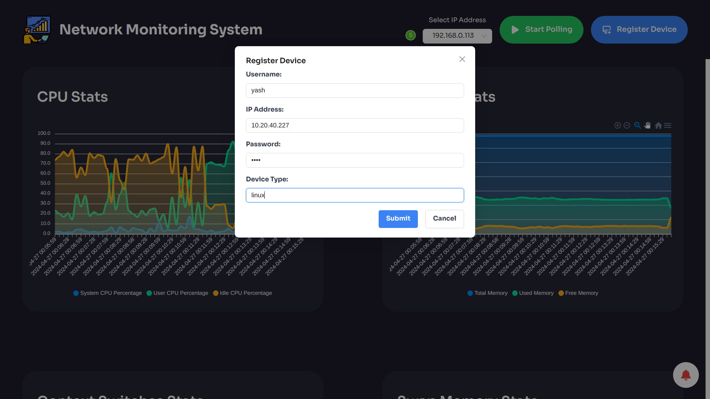
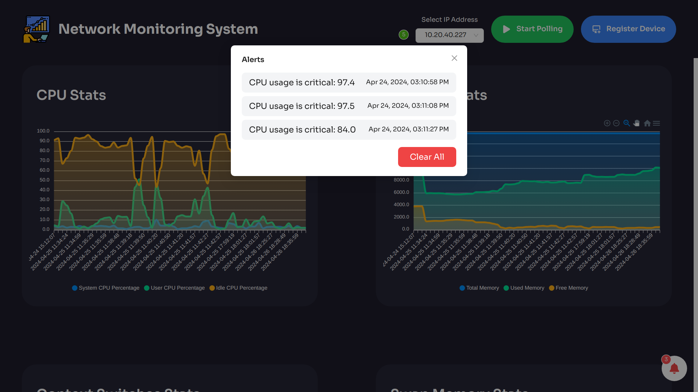

# Network Monitoring System

The Network Monitoring System is a robust application designed to monitor and visualize real-time system metrics for network devices. Utilizing a modern tech stack, it offers efficient backend processing, dynamic frontend interaction, and seamless database management.

## Demonstration
<iframe width="560" height="315" src="https://www.youtube.com/embed/YOM6VJnKgvc?si=iU8k1en_UZhdSkLz" title="YouTube video player" frameborder="0" allow="accelerometer; autoplay; clipboard-write; encrypted-media; gyroscope; picture-in-picture; web-share" referrerpolicy="strict-origin-when-cross-origin" allowfullscreen></iframe>

## Technologies Used
### Backend
* **Java**: Powering the backend logic for robust functionality.
* **Vert.x Core & Vert.x Web**: Enabling reactive, high-performance web handling.
* **Golang**: Plugin engine for fetching network devices (Routers, Switches & Firewalls) data with high concurrency.
* **ZeroMQ**: Asyncronous messaging queue for non-blocking data transfer between Java backend and Golang plugin engine.
* **Logger**: Ensuring comprehensive event logging for system monitoring.

### Frontend
* **React.js**: Driving the frontend with dynamic UI components.
* **Tailwind CSS**: Styling the interface for a sleek, responsive design.
* **ApexCharts**: Visualizing data with interactive and engaging chart displays.

## Database
* **MySQL**: Managing and storing system metrics data & alerts generated efficiently and securely.

## Features
* Supports monitoring upto **1,000** devices.
* Real-time monitoring of CPU, memory, and other vital system metrics.
* Interactive charting for analyzing historical data trends.
* User-friendly interface, optimized for usability.
* Scalable backend architecture ensures seamless performance under varying loads.

## Screenshots

## Backend APIs
1. Backend + Frontend: [Click here](https://github.com/thatbackendguy/network-monitoring-system/blob/main/README.md)
2. Backend (v6.1) + Plugin Engine (Golang): [Click here](https://github.com/thatbackendguy/nms-lite/blob/v6.1/NMS-Backend.postman_collection.json)

## GitHub Repo

