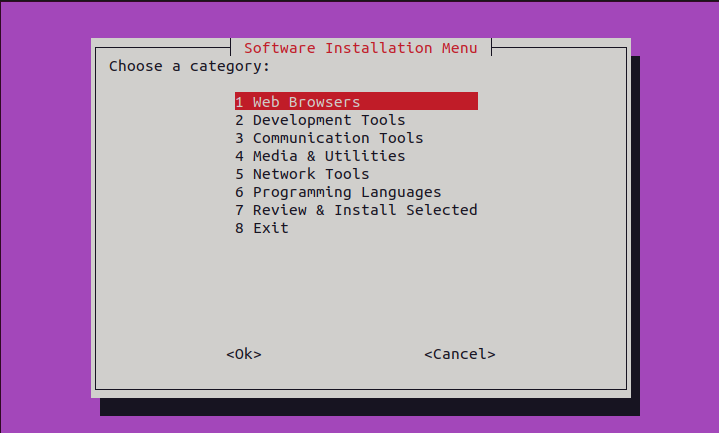
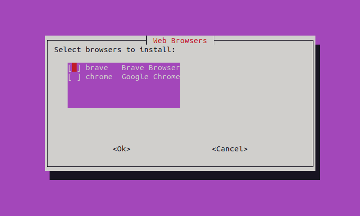
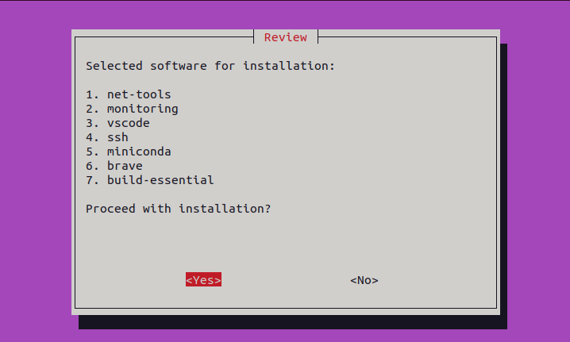

# Batch Install Script for Linux Setup


This script facilitates the installation of multiple applications in a single run, particularly useful for students or users setting up a Linux system for the first time.

## Prerequisites
Before running the script, ensure that `curl` is installed on your system.

#### Install `curl` on Ubuntu/Debian
```
sudo apt update
sudo apt install curl -y
```

#### Install `curl` on CentOS/Fedora
```
sudo dnf install curl
```

### Script Installation
Running this command on your terminal will walk you through the installation steps.
```
sudo bash -c "$(curl -fsSL https://raw.githubusercontent.com/thatbackendguy/batch-install/main/install.sh)"
```

### Installed Programs
The script installs the following programs:
1. **Web Browsers**: Google Chrome, Brave
2. **Development Tools**: build-essentials, VSCode, GIT, GitHub-CLI, GitHub Desktop (unofficial), Miniconda3
3. **Communication Tools**: Discord, Anydesk
4. **Media & Utilities**: VLC, FileZilla, VirtualBox
5. **Network Tools**: net-tools, Wireshark, SSH, Telnet, Monitoring-Tools
6. **Programming Languages**: Python3, Node.js, Java17

### Screenshots




## Congratulations! 🎉
You have successfully installed the programs without any hassle. ✅
</img>